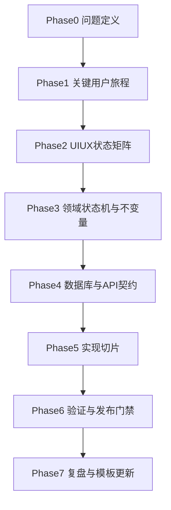

# Couple Planet 功能交付工作流模板
> 面向本项目 owner 的可执行模板（产品 -> UI/UX -> 状态机/数据库 -> API -> 实现 -> 测试 -> 发布/复盘）

## 0. 使用说明

本模板用于避免“文档看起来完整，但真实质量不足”的问题。  
每个阶段都包含：

- 输入（Input）
- 输出（Output）
- 完成定义（DoD）
- AI 可用方式与禁区
- 进入下一阶段的门禁（Gate）

建议按“单功能、单纵向切片”执行，不建议并行铺开多个未冻结功能。

## 1. 端到端流程图



## 2. 阶段模板

## Phase 0：问题定义（Problem Definition）

### Input

- 需求意图与业务背景
- 上一版本遗留问题与风险
- 对齐文档：`docs/couple-planet/mvp-prd-v1.md`

### Output

- 一页功能构想卡（建议字段）：
  - 用户是谁
  - 目标场景是什么
  - 成功定义是什么
  - 本版本不做什么（Out of Scope）
  - 失败后如何止损

### DoD

- 功能目标可用一句话说明
- In Scope 与 Out of Scope 明确
- 已识别至少 3 个主要风险

### AI 用法

- 可做：候选方案发散、风险清单初稿
- 禁做：AI 直接替代业务优先级裁决

### Gate

- 未明确 Out of Scope，不得进入 Phase 1

---

## Phase 1：关键用户旅程（User Journeys）

### Input

- Phase 0 功能构想卡
- 现有流程约束：`docs/couple-planet/ui-workflow.md`

### Output

- 3-5 条关键旅程（每条必须含）：
  - Happy Path
  - Edge Case
  - Failure Recovery

建议格式：

```text
JourneyName:
- Entry:
- HappyPath:
- EdgeCase:
- FailureRecovery:
- SuccessSignal:
```

### DoD

- 每条旅程都包含失败恢复路径
- 每条旅程都有可观察成功信号（接口返回/页面状态/埋点）

### AI 用法

- 可做：补边界条件、补失败路径
- 禁做：用“看起来合理”的故事替代真实可验证流程

### Gate

- 若任一关键旅程无 Failure Recovery，不得进入 Phase 2

---

## Phase 2：UI/UX 状态矩阵（State Matrix）

### Input

- Phase 1 旅程清单
- Figma 规范：`docs/couple-planet/figma-bootstrap-pack.md`
- UI 协同流程：`docs/couple-planet/ui-workflow.md`

### Output

- 页面状态矩阵（每页最少）：
  - `default`
  - `loading`
  - `empty`
  - `error`
  - `disabled`
  - `readOnly`
  - `success_feedback`
- 每个状态的交互规则（点击、禁用、重试、回退）

### DoD

- 页面状态覆盖完整
- 每个状态都映射到具体触发条件
- Figma Frame 与页面映射关系可追溯

### AI 用法

- 可做：校验状态遗漏、生成状态对照表草稿
- 禁做：在无状态定义下直接生成 UI 代码

### Gate

- 状态矩阵未冻结，不得进入 Phase 3

---

## Phase 3：领域状态机与业务不变量（Domain Model）

### Input

- Phase 1 与 Phase 2 输出
- 现有策略文档：
  - `docs/couple-planet/relationship-unbind-policy.md`
  - `docs/couple-planet/communication-boundary-spec.md`
  - `docs/couple-planet/location-routing-constraints.md`

### Output

- 领域状态机（按域拆分）：
  - `Relation`
  - `Invite`
  - `Message`
  - `Unbind`
  - `Archive`
- 不变量清单：
  - 唯一性不变量
  - 时序不变量
  - 权限不变量
  - 幂等不变量

建议最小模板：

```text
Entity:
- States:
- AllowedTransitions:
- ForbiddenTransitions:
- Invariants:
- AuditEvents:
```

### DoD

- 每个域至少列出一个异常分支
- 不变量可映射到 DB/API/代码中的保护点

### AI 用法

- 可做：状态转换图草拟、反例挑战
- 禁做：跳过状态机直接输出数据库字段

### Gate

- 未冻结不变量，不得进入 Phase 4

---

## Phase 4：数据库与 API 契约（DB and API Contract）

### Input

- Phase 3 状态机与不变量
- 现有契约与结构参考：
  - `docs/couple-planet/week1-ddl.sql`
  - `docs/couple-planet/week1-api-contract.md`
  - `docs/couple-planet/week1-structure-mapping.md`

### Output

- 数据库设计稿：
  - 表与字段
  - 唯一键/外键/检查约束
  - 索引策略
  - migration 计划
- API 契约冻结稿：
  - 请求/响应结构
  - 错误码
  - 幂等策略
  - 边界行为

### DoD

- 每条不变量都能定位到一个 DB 或 API 保护点
- 错误码覆盖所有关键失败路径
- API 契约与 UI 状态有一一对应关系

### AI 用法

- 可做：错误码清单补漏、约束一致性检查
- 禁做：在无不变量映射时产出“完整数据库方案”

### Gate

- 契约未冻结，不得进入 Phase 5

---

## Phase 5：实现切片（Vertical Slice Implementation）

### Input

- 冻结 API 契约与 migration
- 任务拆解规范：`docs/couple-planet/mvp-delivery-backlog-v1.md`
- 模块职责参考：`docs/couple-planet/week1-nestjs-modules.md`

### Output

- 一个可运行纵向切片（前后端+数据+状态）
- 对应 Dev Task 的验收清单
- 必要的最小自动化测试与脚本

### DoD

- 新增代码可跑通关键旅程
- 对应错误场景可被触发并正确反馈
- 无法完成的项明确记录为待办风险而非隐式跳过

### AI 用法

- 可做：样板代码、重构建议、边界提醒
- 禁做：绕过验收标准直接“完成任务”

### Gate

- 没有纵向可运行证据，不得进入 Phase 6

---

## Phase 6：验证与发布门禁（Validation and Go/No-Go）

### Input

- 实现切片
- 现有验证清单：
  - `docs/couple-planet/week1-api-verification.md`
  - `docs/couple-planet/week1-day6-day7-acceptance.md`
  - `docs/couple-planet/week1-flow-regression-checklist.md`
  - `docs/couple-planet/mobile-iteration-regression-checklist.md`
- 发布流程：
  - `docs/release/release-checklist.md`
  - `docs/release/go-no-go-latest.md`

### Output

- 验证结果与证据文档
- 缺陷分级（P0/P1/P2）
- Go/No-Go 结论

### DoD

- 关键链路通过
- P0 为 0
- 证据可追溯并可复现

### AI 用法

- 可做：回归清单整理、结果总结
- 禁做：替代真实执行测试并宣称“已验证”

### Gate

- 证据不齐全不得 Go

---

## Phase 7：复盘与模板更新（Retrospective）

### Input

- 本轮验证证据
- 缺陷与返工记录

### Output

- 复盘卡（建议字段）：
  - 本轮最早出现偏差的阶段
  - 本轮最有效门禁
  - 本轮应升级为硬约束的规则
  - 模板更新项

### DoD

- 至少沉淀 1 条可复用规则到文档
- 明确下轮优先修正动作

### AI 用法

- 可做：复盘结构化整理、模式归纳
- 禁做：用空泛结论替代具体改进动作

## 3. 编码前最小门禁清单（MUST）

在开始写代码前，以下 8 条必须全部满足：

- [ ] 功能 In Scope 与 Out of Scope 已冻结
- [ ] 3-5 条关键旅程已写完并含 Failure Recovery
- [ ] 页面状态矩阵已完成并对齐 Figma
- [ ] 领域状态机与不变量已冻结
- [ ] DB 与 API 契约已冻结并可评审
- [ ] Dev Task 绑定 PRD/Figma/API/AC
- [ ] 验证清单已指定（API + Mobile + Regression）
- [ ] Go/No-Go 判定口径已预设

## 4. 数据库设计前置问题清单

数据库设计启动前，先回答这些问题：

1. 该域有哪些状态？状态变化的触发器是什么？
2. 哪些状态转换必须禁止？
3. 哪些操作要幂等？幂等键是什么？
4. 哪些字段是审计必需？
5. 哪些约束在 DB 层保证，哪些在服务层保证？
6. 数据淘汰、归档、导出策略是什么？
7. 失败回滚如何定义？

## 5. 需求-设计-实现闭环自查

发布前做一次快速自查：

- [ ] 每条需求都能映射到至少一个旅程
- [ ] 每条旅程都能映射到 UI 状态与接口行为
- [ ] 每条关键不变量都能映射到 DB/API/代码保护点
- [ ] 每个错误码都能触发并被前端正确呈现
- [ ] 每个关键流程都有回归证据

## 6. 建议的文档联动

为减少信息分叉，建议本模板作为上层统领文档使用，并联动以下真源：

- 总流程：`docs/templates/workflow-sop.md`
- 需求与任务系统：`docs/templates/notion-databases-and-views.md`
- UI 协同与输入包：`docs/couple-planet/ui-workflow.md`
- Figma 启动标准：`docs/couple-planet/figma-bootstrap-pack.md`
- API 契约：`docs/couple-planet/week1-api-contract.md`
- 工程结构映射：`docs/couple-planet/week1-structure-mapping.md`
- 联调脚本：`docs/couple-planet/week1-api-verification.md`
- 验收与发布门禁：`docs/couple-planet/week1-day6-day7-acceptance.md`、`docs/release/release-checklist.md`

## 7. 版本建议

建议将本模板作为 `v1` 落地，后续每个迭代按 Phase 7 复盘结果更新 `v2/v3`，优先升级“最常导致返工”的门禁项。
