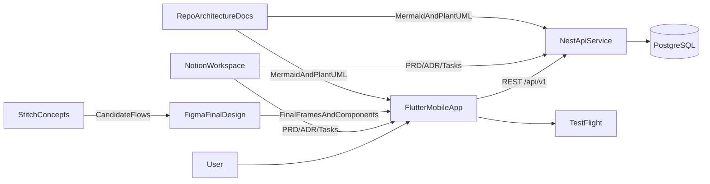
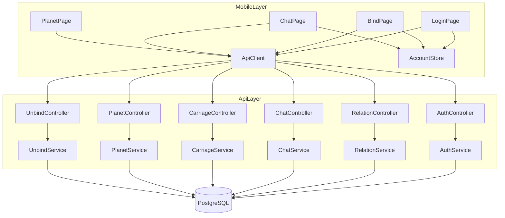
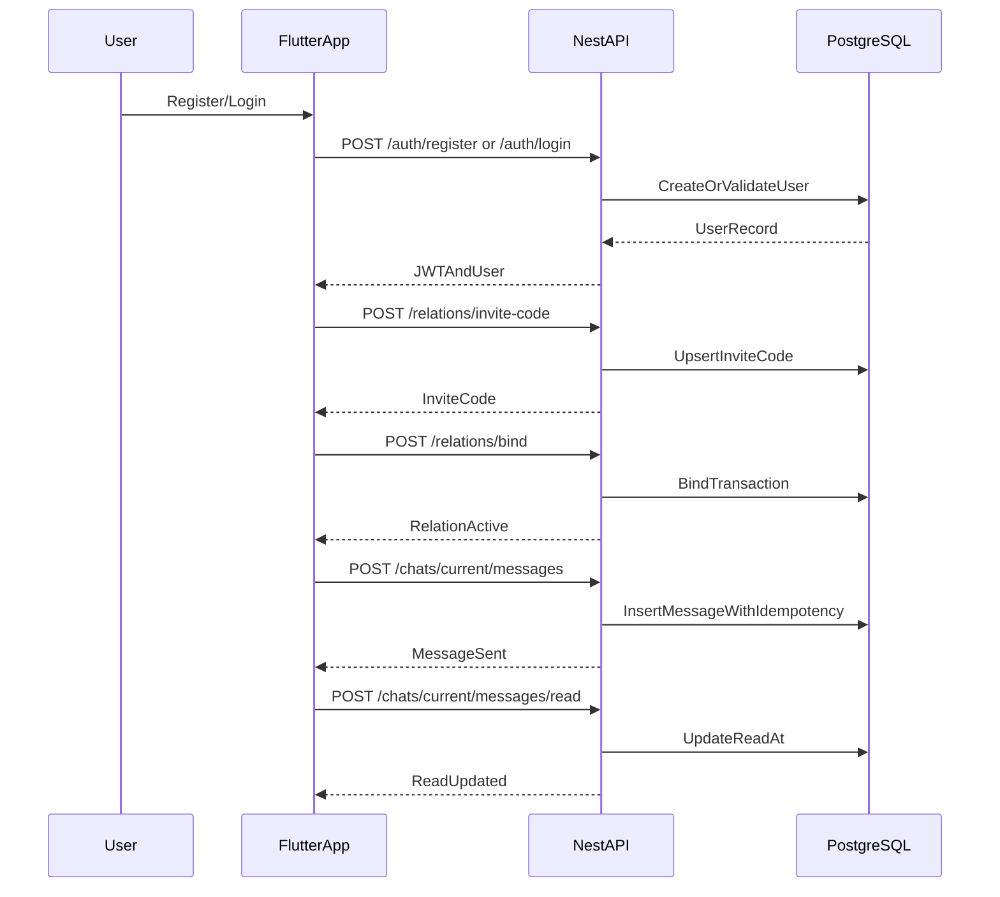
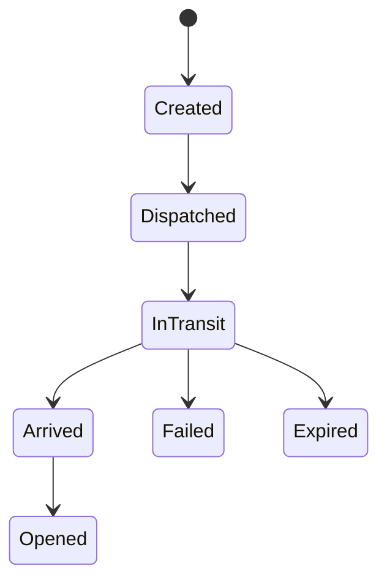
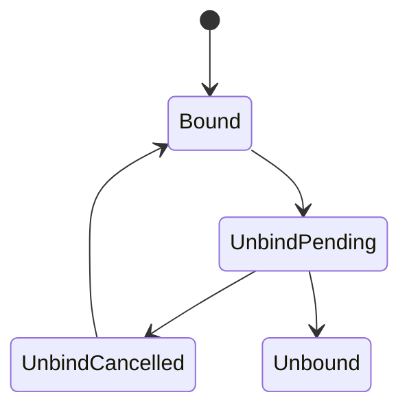
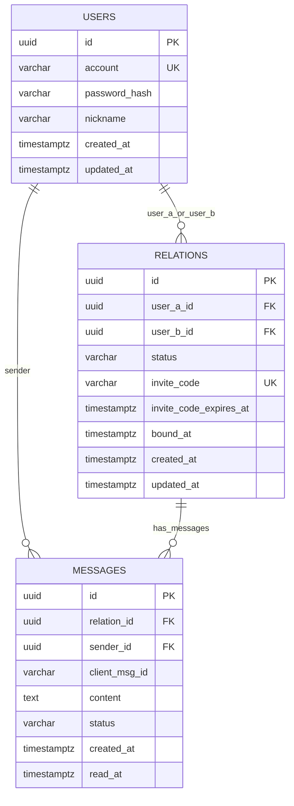

# Couple Planet MVP 架构与数据资料包

## 1. 目的与真源

本文件整合首个产品 MVP 的系统设计、图示、模块与数据库设计，作为综合阅读版。

图源真源：

- 系统上下文：`docs/architecture/system-context.mmd`
- 移动端-后端模块图：`docs/architecture/mobile-backend-modules.puml`
- 模块职责：`docs/couple-planet/week1-nestjs-modules.md`
- API 契约：`docs/couple-planet/week1-api-contract.md`
- 数据库 DDL：`docs/couple-planet/week1-ddl.sql`

## 2. 系统设计总览

## 3. 模块职责分层

## 3.1 移动端（Flutter）

- `features/auth/*`：注册登录、会话恢复
- `features/relation/*`：邀请码绑定与关系分流
- `features/chat/*`：即时通道、重试、已读展示
- `core/api_client.dart`：API 访问统一入口
- `AccountStore`：登录态与账号切换（样板中已使用）

## 3.2 后端（NestJS）

来源：`docs/couple-planet/week1-nestjs-modules.md`

- `AuthModule`：`register/login/me`
- `RelationModule`：`invite-code/bind/current`
- `ChatModule`：`list/send/read`
- 通用层：`JwtAuthGuard`、`request-id interceptor`、统一异常响应

## 3.3 后续 Sprint 扩展模块（MVP 全量）

来源：`docs/couple-planet/mvp-prd-v1.md`、`sprint2-4-execution-pack-*`

- `CarriageModule`：信封状态机与调度
- `RoutingModule`：ETA 预估与降级
- `PlanetModule`：状态机、能量流水、星屑累计
- `UnbindArchiveModule`：冷静期、封存、导出
- `AnalyticsModule`：埋点采集与 KPI 聚合

## 4. 类图 / 模块图（综合视图）

说明：详细依赖以 `docs/architecture/mobile-backend-modules.puml` 为真源。下图用于综合阅读。

## 5. 关键业务流程图

## 5.1 注册到消息闭环（Week1）

## 5.2 马车信封闭环（Sprint2）

## 5.3 解绑闭环（Sprint4）

## 6. 数据库设计（Week1 冻结）

来源：`docs/couple-planet/week1-ddl.sql`

## 6.1 ER 关系（最小闭环）

## 6.2 核心约束

- `users.account` 唯一
- `relations` 禁止自绑定（`user_a_id <> user_b_id`）
- 关系无序对唯一（`LEAST/GREATEST` 索引）
- 单用户 active relation 唯一（两个 partial unique 索引）
- 消息幂等键：`(sender_id, client_msg_id)` 唯一
- `messages.content` 非空（trim 后长度 > 0）

## 6.3 核心索引

- `idx_messages_relation_created`：历史分页
- `idx_messages_relation_read_at`：已读更新
- `idx_relations_bound_at`：关系历史/审计

## 6.4 后续 Sprint 数据扩展建议

为支持 MVP 全量范围，建议新增表（暂不在 Week1 DDL 落地）：

- `carriage_envelopes`
- `carriage_events`
- `planet_daily_states`
- `energy_ledger`
- `stardust_ledger`（或聚合字段）
- `unbind_requests`
- `archive_export_tasks`
- `analytics_events`

## 7. 接口与数据映射（关键样例）

## 7.1 发送即时消息

- API：`POST /chats/current/messages`
- 入参：`clientMsgId`、`content`
- 落库：`messages.client_msg_id`、`messages.content`
- 保护点：`uq_messages_sender_client_msg` 防重复

## 7.2 绑定关系

- API：`POST /relations/bind`
- 入参：`inviteCode`
- 落库：`relations.user_a_id/user_b_id/status/bound_at`
- 保护点：关系唯一 + active 唯一 + 禁止自绑定

## 8. 架构审查检查表（每个 Sprint）

- [ ] 模块职责是否有新增且已反映到图源
- [ ] 关键状态机是否有新增分支并写入文档
- [ ] 新接口是否有对应错误码与幂等策略
- [ ] 新数据字段是否有约束与索引依据
- [ ] 架构变更是否先改仓库图源再同步外部评审板
