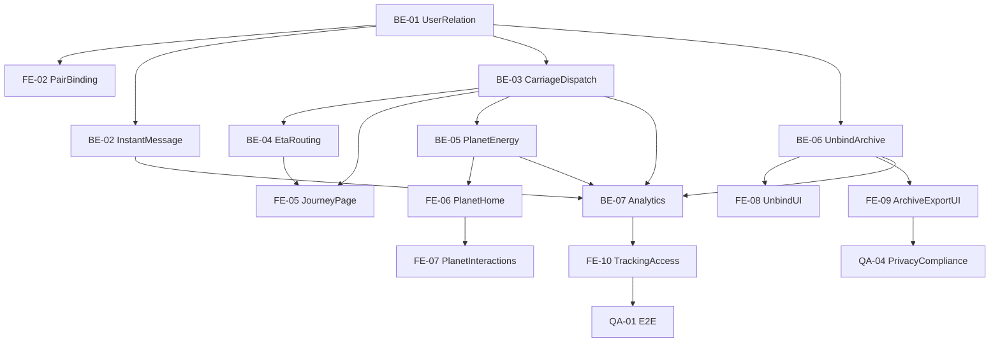

# 情侣星球 MVP 交付任务清单 v1

## 1. 使用说明

本清单可直接用于 Jira/飞书项目管理，按端拆分任务并给出：

- 优先级（P0/P1）
- 依赖关系
- 完成定义（Definition of Done, DoD）
- 验收标准（Acceptance Criteria, AC）

迭代建议：6-8 周，按 4 个 Sprint 执行。

## 2. Sprint 划分（建议）

- Sprint 1（Week 1-2）：账号、绑定、即时消息基础链路
- Sprint 2（Week 3-4）：马车信封创建、ETA、旅程状态同步
- Sprint 3（Week 5-6）：星球状态机、轻交互、能量流水
- Sprint 4（Week 7-8）：解绑冷静期、封存导出、压测与灰度上线

## 3. 前端任务（App）

## FE-01 注册登录与会话初始化

- 优先级：P0
- Sprint：1
- 依赖：无
- DoD：
  - 支持注册/登录/会话恢复
  - 登录态异常可重试并有错误提示
- AC：
  - 新用户 3 步内完成登录
  - token 失效自动跳转登录并保留页面上下文

## FE-02 双人绑定流程（邀请码/扫码）

- 优先级：P0
- Sprint：1
- 依赖：BE-01
- DoD：
  - 可发起绑定、接收绑定、展示绑定状态
  - 绑定失败有明确原因反馈
- AC：
  - 同一账号不能重复绑定多对象
  - 绑定成功后首页可见双方关系信息

## FE-03 即时通道聊天页

- 优先级：P0
- Sprint：1
- 依赖：BE-02
- DoD：
  - 文本/表情发送与已读展示可用
  - 弱网下消息状态可恢复
- AC：
  - 95% 场景消息在 1 秒内到达
  - 消息重发不产生重复展示

## FE-04 马车信封发送入口与升级建议卡

- 优先级：P0
- Sprint：2
- 依赖：BE-03
- DoD：
  - 长文本/语音/图片触发升级建议卡
  - 用户可一键切换即时/马车发送
- AC：
  - 命中规则时建议卡出现率 100%
  - 用户可跳过建议卡继续即时发送

## FE-05 马车旅程页（ETA/里程/事件）

- 优先级：P0
- Sprint：2
- 依赖：BE-03, BE-04
- DoD：
  - 展示在途状态、ETA、事件记录
  - 到达后状态与会话页一致
- AC：
  - 状态从 `InTransit` 到 `Arrived` 无倒退
  - ETA 刷新不闪烁、不跳变异常

## FE-06 星球主页与状态机表现

- 优先级：P0
- Sprint：3
- 依赖：BE-05
- DoD：
  - 实现 `Dormant/Warm/Active/Bloom` 四态视觉
  - 冷启动默认进入星球页
- AC：
  - 状态变更后 1 秒内视觉反馈完成
  - 首次用户可在 3 分钟内理解状态差异

## FE-07 星球轻交互与快捷跳转

- 优先级：P1
- Sprint：3
- 依赖：FE-06
- DoD：
  - 点击、长按、上滑、点轨迹、点能量槽可用
- AC：
  - 交互响应 < 200ms（动画先行）
  - 交互失败率 < 0.5%

## FE-08 解绑管理页与冷静期体验

- 优先级：P0
- Sprint：4
- 依赖：BE-06
- DoD：
  - 发起解绑、撤销、倒计时展示、生效结果展示完整
  - 高风险操作二次确认
- AC：
  - 冷静期剩余时间与服务端一致
  - 生效后相关入口即时禁用

## FE-09 回忆封存与导出申请页

- 优先级：P1
- Sprint：4
- 依赖：BE-06
- DoD：
  - 用户可发起导出并查询任务状态
  - 封存内容只读展示
- AC：
  - 导出申请结果可追踪
  - 删除操作必须二次确认

## FE-10 埋点接入与看板字段校验

- 优先级：P0
- Sprint：4
- 依赖：BE-07
- DoD：
  - 关键埋点完整接入，字段与事件名统一
- AC：
  - 埋点丢失率 < 1%
  - 上报字段通过数据团队验收

## 4. 后端任务（Server）

## BE-01 用户与关系绑定服务

- 优先级：P0
- Sprint：1
- 依赖：无
- DoD：
  - 提供注册、登录、绑定、解绑基础 API
  - 实现唯一配对约束
- AC：
  - 并发绑定不产生脏数据
  - 关系状态可追溯

## BE-02 即时消息服务与已读状态

- 优先级：P0
- Sprint：1
- 依赖：BE-01
- DoD：
  - 文本/表情消息收发链路稳定
  - 已读状态可同步
- AC：
  - 发送成功率 >= 99.9%
  - 消息不丢失、不重复入库

## BE-03 马车信封调度服务

- 优先级：P0
- Sprint：2
- 依赖：BE-01
- DoD：
  - 实现状态机：`Created -> Dispatched -> InTransit -> Arrived -> Opened`
  - 支持失败态与过期态
- AC：
  - 状态推进幂等
  - 重复回调不重复奖励

## BE-04 路径与 ETA 计算服务

- 优先级：P0
- Sprint：2
- 依赖：BE-03
- DoD：
  - 接入地图 API，支持低频修正与降级逻辑
  - 支持最短/最长 ETA 边界约束
- AC：
  - ETA 接口 p95 < 300ms（缓存命中）
  - 单封地图调用均值 <= 2

## BE-05 星球状态与能量流水服务

- 优先级：P0
- Sprint：3
- 依赖：BE-01, BE-03
- DoD：
  - 输出星球状态、互动摘要、能量明细 API
  - 支持星屑累计展示
- AC：
  - 互动行为与状态变更可追踪
  - 能量账本不出现负值异常

## BE-06 解绑冷静期、封存与导出服务

- 优先级：P0
- Sprint：4
- 依赖：BE-01, BE-02, BE-03
- DoD：
  - 实现 `UnbindPending/UnbindCancelled/Unbound` 流程
  - 支持封存、导出、删除策略
- AC：
  - 冷静期到点自动生效
  - 生效后数据隔离错误率 = 0

## BE-07 埋点采集与指标聚合

- 优先级：P0
- Sprint：4
- 依赖：BE-02, BE-03, BE-05, BE-06
- DoD：
  - 关键埋点可写入并可供看板消费
- AC：
  - 核心事件延迟入仓 < 5 分钟
  - 指标口径与 PRD 一致

## BE-08 通知与推送编排

- 优先级：P1
- Sprint：4
- 依赖：BE-03, BE-06
- DoD：
  - 到达提醒、冷静期通知、生效通知可达
- AC：
  - 推送失败可回补（下次启动拉取）
  - 通知去重生效

## 5. 测试任务（QA）

## QA-01 端到端主链路测试

- 优先级：P0
- Sprint：1-4 持续
- 覆盖：
  - 注册 -> 绑定 -> 即时消息
  - 马车信封发送 -> 到达 -> 开启
  - 星球状态变更 -> 互动回访
  - 解绑发起 -> 冷静期 -> 生效/撤销
- AC：
  - 主链路阻断缺陷为 0

## QA-02 弱网与断网恢复测试

- 优先级：P0
- Sprint：2-4
- 覆盖：
  - 消息重试
  - 状态补偿
  - 旅程页恢复一致性
- AC：
  - 弱网场景恢复成功率 >= 98%

## QA-03 性能与稳定性测试

- 优先级：P0
- Sprint：4
- 覆盖：
  - 在途信封高并发
  - 接口延迟与超时
  - 客户端交互耗时
- AC：
  - 信封送达成功率 >= 99%
  - 1 万并发在途状态推进无积压

## QA-04 隐私与合规测试

- 优先级：P0
- Sprint：4
- 覆盖：
  - 定位授权拒绝路径
  - 导出与删除流程
  - 解绑审计日志完整性
- AC：
  - 高风险操作均有二次确认
  - 审计日志字段完整

## 6. 关键依赖关系图

## 7. 上线前 Go/No-Go 清单

- P0 任务全部完成并验收通过
- 阻断级缺陷（P0 bug）为 0
- 核心指标可观测（埋点 -> 看板）
- 灰度发布回滚预案完成

## 8. 对应 PRD 与规范

- `docs/couple-planet/mvp-prd-v1.md`
- `docs/couple-planet/communication-boundary-spec.md`
- `docs/couple-planet/planet-mvp-role-spec.md`
- `docs/couple-planet/location-routing-constraints.md`
- `docs/couple-planet/relationship-unbind-policy.md`
